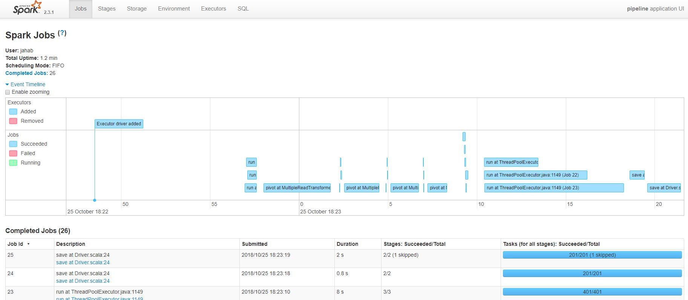
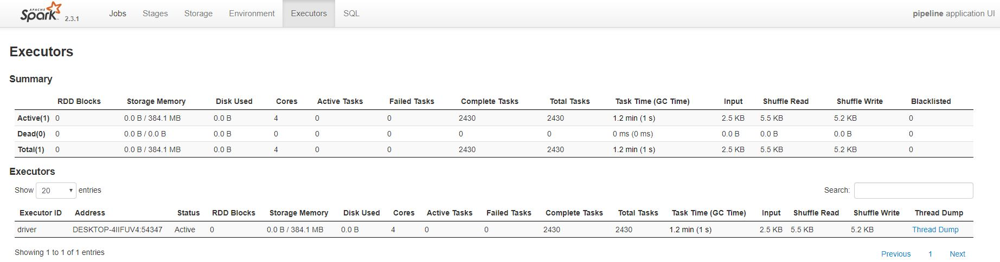
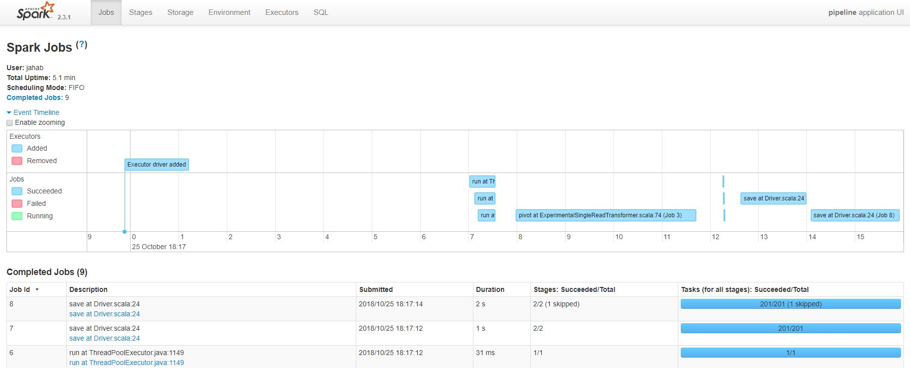
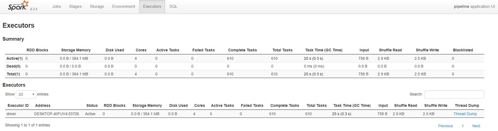

# Pipeline

## Setup

Within Intellij set up an application which points to `pipeline.Driver` and set the VM options to be `-Xms512M -Xmx1024M -Xss1M -XX:+CMSClassUnloadingEnabled`.

## Description

The `Driver.scala` file handles loading source data from `./data`folder. It calls into`Transformer.transform`and stores the result of the transform step in the `result.csv` file.

### Data

`Derms` contain data about the dermatologist who makes evaluations.

`Evaluation` are the evaluations which derms makes for given images (imageId). The diagnosis for an image is given in the Diagnosis field and can either be `NEP` (No Evalution Possible with reasons in the UnfitResons.csv) or some kind of diagnosis (like L.40).

`UnfitReasons` are for evaluations with diagnosis `NEP` which have additional reasons for why the evaluation found the image unfit for evaluation (like being too blurry).

`ClinicalCharacteristics` are used for evaluations where a diagnosis can be done (ie all rows which are not `NEP`). The contain a clinical name and a true/false value indicating if this characteristic is present or not.

## Task

We need an implementation which for each image joins the different derms evaluations along with unfit reasons and clinicals characteristics (depending on the diagnosis).

So for imageId 1 there are two evaluations in the dataset. 

One from Monica with a diagnosis of L.40, which have a some clinical characteristics.
And one from Ionela whth a diagnosis of NEP with a couple of unfit reasons.

The `transform` step should produce one row for each imagine, combining the evaluations of the derms:

```
ImageId, Monica_evaluationId, Monica_diagnosis, Monica_scales, Monica_induration, Ionela_evaluationId, Ionela_diagnosis, Ionela_scales, Ionela_induration, Ionela_bad_light, Ionela_bad_framing
1      , 1                  , L40.0           , true         , false            , 2                  , NEP             , null         , null             , true               , true   
2      , 3                  , L20.2           , false        , false            , 4                  , L41.0           , true         , false            , null               , null        
3      , null               , null            , null         , null             , 5                  , NEP             , null        , null              , true               , true
```

## SOLUTION

As a part of the solution the following changes were done:
* added SparkSessionAndConfigBuilder
* updated SchemaProvider add functionality operate on untyped/string files (used in the experimental transformer)
* added DermatologicalEvaluationWarehouseReader which encapsulates reading of the underlying datasource (returns DataFrames or DataSets)
* replaced the Transformer with MultipleReadTransformer and ExperimentalSingleReadTransformer (two implementations)
* added TransformerTests (ScalaTest)

### MultipleReadTransformer
Simplest possible solution to achieve the goal. Uses multiple passes through the data pivotting each time and creating
partial result. It is not resource optimal, it was first MVP implemented just to be sure the goal can be acheived.

As a part of the work on this task some thought have been given to the Spark Physial Plan. It wasmentioend that the
production code was causing out of memory issue on driver. As the out of memory was occuring on the driver, the first
likely candidate is that BroadcaseHashJoin is called on a large set. It sholud be investigated if changing of the
spark cofiguration can help, forcing Spark to use SortMergeJoin (as well as making sure that ShuffleHashJoin is not used
on large datasets (it is only present in Spark 2.0-2.2).

`
println(evaluationsJoined.explain)
== Physical Plan == without setting spark.sql.autoBroadcastJoinThreshold, all done as broadcast, a very poor test
*(4) Project [evaluationId#48L, imageId#27L, diagnosis#28, dermId#53, name#16, unfitReason#42, clinicalCharacteristicsName#56, selected#5]
+- *(4) BroadcastHashJoin [evaluationId#48L], [evaluationId#3L], LeftOuter, BuildRight
:- *(4) Project [evaluationId#48L, imageId#27L, diagnosis#28, dermId#53, name#16, unfitReason#42]
:  +- *(4) BroadcastHashJoin [evaluationId#48L], [evaluationId#41L], LeftOuter, BuildRight
  :     :- *(4) Project [evaluationId#48L, imageId#27L, diagnosis#28, dermId#53, name#16]
:     :  +- *(4) BroadcastHashJoin [dermId#29], [dermId#53], Inner, BuildRight
  :     :     :- *(4) Project [id#26L AS evaluationId#48L, imageId#27L, diagnosis#28, dermId#29]

 == Physical Plan == with setting spark.sql.autoBroadcastJoinThreshold -1
 *(9) Project [evaluationId#48L, imageId#27L, diagnosis#28, dermId#53, name#16, unfitReason#42, clinicalCharacteristicsName#56, selected#5]
 +- SortMergeJoin [evaluationId#48L], [evaluationId#3L], LeftOuter
    :- *(6) Project [evaluationId#48L, imageId#27L, diagnosis#28, dermId#53, name#16, unfitReason#42]
    :  +- SortMergeJoin [evaluationId#48L], [evaluationId#41L], LeftOuter
    :     :- *(3) Sort [evaluationId#48L ASC NULLS FIRST], false, 0
    :     :  +- Exchange hashpartitioning(evaluationId#48L, 200)
    :     :     +- *(2) Project [evaluationId#48L, imageId#27L, diagnosis#28, dermId#53, name#16]
    :     :        +- *(2) BroadcastHashJoin [dermId#29], [dermId#53], Inner, BuildRight
    :     :           :- *(2) Project [id#26L AS evaluationId#48L, imageId#27L, diagnosis#28, dermId#29]
`

This code results with:
* 26 Spark Jobs in total.
* 2430 Tasks
* 2.5kb input read
* 5.2kb shuffle write
* test execution time 31s (NOTE: unit test time can not be used as a good benchmark of Spark jobs as too much depends on the environment. Nonehteless it is an interesting number to havea lookat)




### ExperimentalSingleReadTransformer

An attempt to produce the same results with only single read of the data. As the hypothetical goal is to reduce resource
utilisation this implementation uses custom transformations which likely reduce the flexibility.

The code uses the following tricks to achieve the goal:
* performs normalization the data by exploding columns into rows
* this step is done in memory using explode (likely can be done in some other way)
* 2 custom UDFs are created to assign correct keys and values to thetable
* single pivot create the final result

This code results with:
* 9 Spark Jobs in total
* 610 Tasks
* 0.7kb input read (clearly showing we are accessing the storage only once)
* 2.5kb shuffle write. This is interesting, as the amount of data shuffled 1/2 (not 1/4) compared to the first implementation. This shows that in-memory rows explosion costs extra shuffle, which is expected
* test execution time 5s


